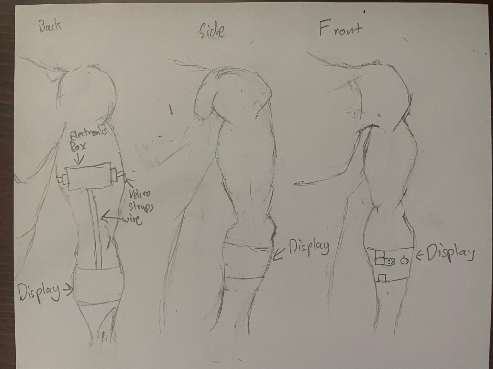

# CyberSnake  
A wearable LED snake game powered by Arduino/ESP32 and a flexible WS2812B LED matrix

 <!-- Optional: replace with your image -->

## Overview
**CyberSnake** is a wearable, arm-mounted snake game built around an **ESP32** and a **flexible WS2812B 8x32 LED matrix panel**. Players control a snake that moves across the LED display using **their phone**, collecting food pixels to grow in length. The display wraps around another person's arm, creating a visually striking and hard game experience. 

---

## Features
- **Arduino/ESP32 powered** — runs all game logic locally  
- **Flexible LED matrix display** — wraps around the arm for a fully wearable experience  
- **Snake gameplay** with growth and food mechanics  
- **Input options** via bluetooth phone  
- **Battery-powered** — fully portable  
- **Customizable** — speed, and snake colors can be easily adjusted

---

## Hardware Components
| Component                        | Description                                     |
|-----------------------------------|-------------------------------------------------|
| ESP32     | Main microcontroller controlling the game      |
| WS2812B 8x32 LED Matrix Panel   | Flexible LED display panel for the snake game |
| Phone | Player input for controlling snake direction |
| Li-Po Battery    | Portable power supply                          |
| Wires, Velcro, | For mounting the display and input device
